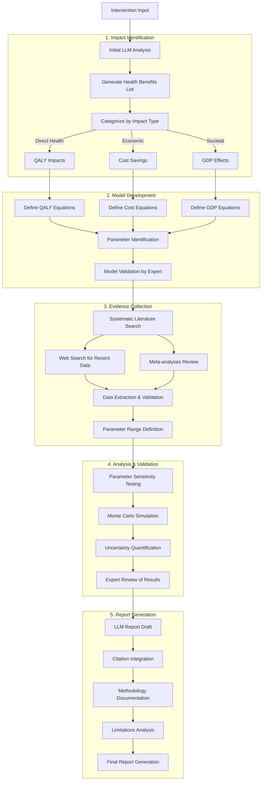

# Health Economic Impact Analysis Workflow

## Key Improvements Over Basic Workflow

1. **Rigorous Validation**
   - Expert review at multiple stages
   - Systematic literature review process
   - Quality assessment of evidence

2. **Better Uncertainty Handling**
   - Monte Carlo simulation
   - Parameter range definition
   - Confidence interval calculation

3. **Enhanced Documentation**
   - Methodology transparency
   - Assumption documentation
   - Limitation acknowledgment

4. **Quality Standards**
   - PRISMA guidelines for literature review
   - CHEERS guidelines for reporting
   - Standardized quality assessment tools

5. **Comprehensive Review**
   - Multiple data sources
   - Expert validation
   - Cross-reference with existing models

## Implementation Notes

1. **Automation Opportunities**
   - Literature search and data extraction
   - Parameter range calculation
   - Report template generation
   - Visualization creation

2. **Quality Control Points**
   - Expert review stages
   - Data validation checks
   - Cross-reference verification
   - Result plausibility checks

3. **Documentation Requirements**
   - Methodology description
   - Data source tracking
   - Assumption listing
   - Limitation documentation

4. **Tool Integration**
   - Literature database APIs
   - Statistical analysis packages
   - Visualization libraries
   - Report generation tools 