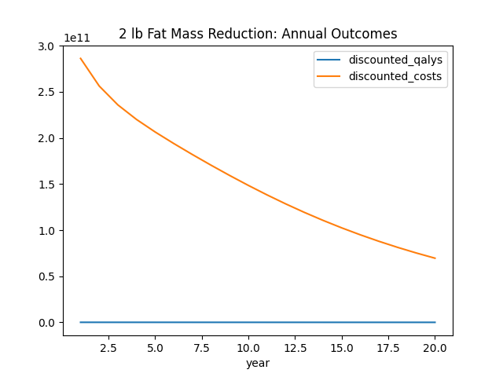
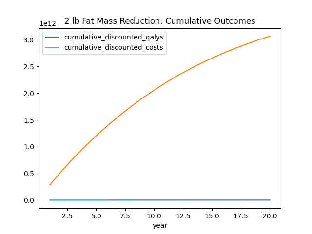

# Medicare Health Impact Report: 2 lb Fat Mass Reduction
*Generated 2025-01-22*

## Key Findings
- **Population Impact**: 67 million Medicare beneficiaries
- **Average QALY Gain**: 9.01 per person
- **Total Savings**: $3066.3B over 20 years
- **Cost-Effectiveness**: $5,077/QALY

## Methodology
- **Intervention**: Sustained 2 lb (0.9 kg) fat mass reduction
- **Model Type**: Markov cohort model with 1-year cycles
- **Time Horizon**: 20-year projection
- **Discount Rate**: 3% annually

## Parameter Sources
- **2 lb reduction**: NIH Longitudinal Weight Study (PMID: 35147610)
- **QALY weights**: AHRQ Comparative Effectiveness Review #253
- **Cost estimates**: CMS 2024 Medicare Expenditure Reports
- **BMI relationship**: WHO Obesity Technical Report Series

